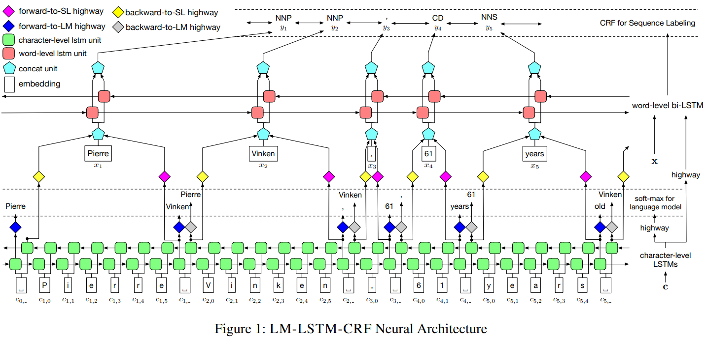
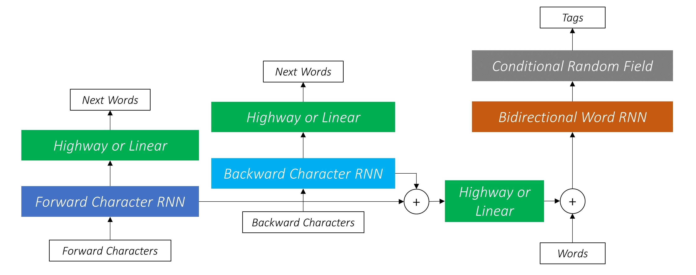
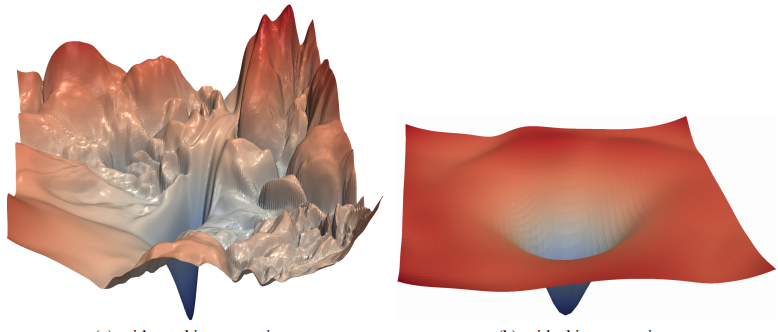
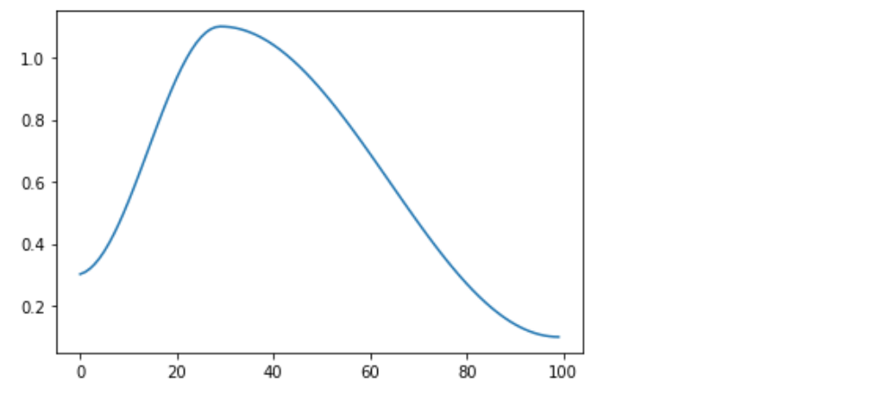

# Sequence_Labeling_Project

Linguistic *sequence labeling* is a general approach encompassing a verity of problems. One of the crucial reason that this repo exists is because a collection of techniques used in this project is one of the building blocks of my [surgical robotics vision]() project. In addition to that, we are going to replicate the architecture used in the [Empower Sequence Labeling with Task-Aware Neural Language Model](https://arxiv.org/pdf/1709.04109.pdf) paper, which is considered as one of the more sophisticated models out there for tasks such as **Poart-Of-Speech** (POS) and **Named-Entity-Recognition** (NER). This paper is packed of useful techniques that can be potentially extended to other deep learning applications.

Acknowledgement, this repo is heavy guided by [sgrvinod](https://github.com/sgrvinod)‘s tutorial and also a few ideas that I have learned from the [FastAI course v3](https://course.fast.ai/).

## Overview

*   [***Model architecture***](https://github.com/Sylar257/Sequence_Labeling_Project#architecture) 
*   [***Deep dive into various techniques***](https://github.com/Sylar257/Sequence_Labeling_Project#techniques)
*   [***PyTorch realization***](https://github.com/Sylar257/Sequence_Labeling_Project#realization)
*   [***Sequence tagging and surgical robotics vision***](https://github.com/Sylar257/Sequence_Labeling_Project#surgical_robotics_vision)

## Architecture

The development of deep neural networks made it possible for us to build reliable models for POS and NER tasks without handcrafting features. The paper provides us with a very concise and robust model and incorporates both **word-level** information as well as **character-level** information. In addition, the architecture also features *transfer learning* the knowledge from another related task. However, this is not done in the traditional *transfer learning* way but realized by conducting **multi-task learning**. (the details of multi-task training strategy will be covered in the next section)



The model is called **LM-LSTM-CRF** which is essentially the concatenation of the important techniques they have applied. The model, which is very well described as above, looks fairly complicated at first glance. A lot of things seem to be going on at the same time. Don’t worry, I will decouple them for you later and you will realize that the great result that this architecture achieved comes from a smart combination of a few useful deep learning tricks.

As the name suggests, the model has three main components: 

1.  Character-level LSTMs(there are two of them, one forward one backward) that is trained concurrently with a  **language model**. 
2.  Word-level bi-directional **LSTM** with additional input of high-way connections from features extracted by character-level LSTM
3.  **Conditional Random Field** as the output layer that eventually performs the labelling

### Character-level LSTMs

The objective of this layer come in two folds:

*   **Chracter-level feature** extractions that will be used as parts of input for **word-level LSTM**
*   **Neural language model** training(this multi-task training strategy is used to boost model’s performance)

There are two character-level LSTMs that extracts feature by reading the documents in, forward direction and backward direction, respectively. 

As shown below, the output of these two LSTMs(in blues) are flowing to two places: 

*   predicting next word(this is the language model part)
*   concatenated together to be used as part of input for word-level bidirectional LSTM



Note that the outputs of character-level has the option of passing through **Highway connections **(this concept will be explained in the technique section). For now, we can think of them as linear connections with more advance computations.

Finally, there is one more thing we need to decide when designing the architecture: when performing back-propagation, how is the error going to be aggregated from the two source(namely, one from predicting next word another from the main tasks itself). In the paper, the authors take weighting of $1:1$. Since this repo is an exact replica, we will take it. For the more advanced weighting strategy please refer to [this paper](https://zpascal.net/cvpr2017/Kendall_Geometric_Loss_Functions_CVPR_2017_paper.pdf) where we can devise the loss with two *learnable* parameters that learns to balance the loss ratio.

### Word-level Bi-directional LSTM

The Bi-directional LSTM take input of a concatenation of **word sequence**(after passing through pre-trained word embeddings) and **features extracted by character-level LSTM**. We are able to directly use bi-lstm here since we are not doing multi-task training, hence we can satisfied with getting the combined features of bi-lstm.

### CRF for sequence labeling

**CRF** stands for conditional random fields which is popularly used to model *ordered information*. The output of bi-lstm is passed through **CRF** before the actually labeling is made. Taking a step back, a more naive approach is to take the activation from the **bi-lstm** and just sample the most possible tag for that given activation. First of all, this is not a bad strategy at all. However, **CRF** could potentially do better because it allows us to *leverage more information when making the decision*. 

Put in simple words, instead of merely consider the give activation, **CRF** allows the model to compute the possibility of the sampling each tag **GIVEN** the *neighborhood tags*.  The math behind is that, instead of only compute the **emission scores** (from bi-lstm activaations), we also compute the **transition score** which represent the **likelihood of sampling the tag `i` given the previous word was assigned to tag `j`**.

### Last word for architecture

So there you have it, this *more advanced* model architecture. It’s super sophisticated and effective but not so difficult to understand after all.

In a nutshell, we have 3 streams of information being fed into the **word-level bi-lstm**: the feature extraction from *forward character-level lstm*, the feature extraction from *backward character-level lstm*, and the word-level information itself. 

```python
# character-level
cf, _ = self.forw_char_lstm(cf)  
cb, _ = self.back_char_lstm(cb)   

# Unpack packed sequence
cf, _ = pad_packed_sequence(cf, batch_first=True)
cb, _ = pad_packed_sequence(cb, batch_first=True) 

# gather character-level info to the right word-level position
cf_selected = torch.gather(cf, 1, index=cmarkers_f) 
cb_selected = torch.gather(cb, 1, index=cmarkers_b)

# concate forward and backward; pass through high-way connection
subword = self.subword_hw(self.dropout(torch.cat((cf_selected, cb_selected), dim=2)))
subword = self.dropout(subword)

# Embedding look-up for words
w = self.word_embeds(wmaps) 
w = self.dropout(w)

# Concatenate word embeddings and sub-word features
w = torch.cat((w, subword), dim=2) # ready for bi-lstm
```

## Techniques

What makes this paper special is the collection of useful techniques the authors choose to apply to the architecture in order to boost the performance. We are going to focus on a few, namely, **multi-task learning**, **neural language model**, **viterbi decoding** and **high-way connections**.

### Multi-task Learning

A technique that has revolutionized the computer vision world (and potentially the NLP world as well by *ULMFiT*) is [**transfer learning**](https://arxiv.org/abs/1808.01974). Essentially, researchers have learned that we can transfer the knowledge we have learned from different but related task if some basic rules are met. **Multi-task learning** is similar to **transfer learning** in a way that when we have limited training data, we can boost the performance of our model by the leveraging the knowledge learned from another task. Only this time, the training of different tasks happens **concurrently**. The **character-level lstm** model is trained along side a **neural language** model. Which essentially means that the output of the *character-level lstm* will be used in the two different tasks and there will be two loss gradients flowing back during the back-prop stage. 

It was worth noting that, the implementation isn’t as simple as “let’s plug everything in together”. It was found by the authors that, based on experiments, when the tasks are discrepant, **language model trainings** could be harmful to **sequence labeling** in a naive co-training setting. This is understandable because without proper regulation, we have no necessary grantee that by *training the character-level lstm to be better language models* is always going to beneficial to the **sequence labeling** task. To mitigate this challenge, the authors proposed to apply **high-way connections** in order to transform the output of **character-level lstm** into different semantic space. With this understanding in mind, now it’s good time to introduce **neural language model** and **high-way connections**.

### Neural language model

This is a family of models that are often used for article generation(#Shakespeare). Actually, not just word generation, they works on any types of sequence generation. The neural language modeling problem can be mathematically formulated as follows:


Which translates to English as: give a sequence of words, what is the likelihood the **next word** for all words in the vocabulary.

In the implementation of this sequence labeling project, two **neural language models** are training concurrently with the forward and backward character level lstm with the objective of improving model accuracy. As the authors pointed out: *However, different from typical models of this setting, our two tasks are not strongly related. This discordance makes our problem more challenging.*

To mediate these two tasks, the authors transform the output of character-level layers into different semantic spaces for different objectives. This strategy allows character-level layers to focus on general feature extraction and lets the transform layers select task-specific features. Hence, the language model can provide related knowledge to the sequence labeling, without forcing it to share the whole feature space.

### Highway Networks

There is a famous CNN architecture in computer vision call [**ResNet**](https://arxiv.org/abs/1512.03385) in which there are many *residual blocks*.  What researchers found is that the incorporation of *residual blocks* allow us to train much deeper networks with good convergence. When researchers try to visualize the loss surfaces of CNN with(right) and without(left) residual blocks, they found that the existence of *residual* connections greatly smoothen out the loss surface and made it more possible for the optimizer to find the global minimum.



This could also be explained from another perspective by looking the *residual connection* formula:


Therefore, the `conv_block` could decide to learn nothing and produce a value of `0` , thus the whole block will give a result same as its input essentially ‘bypass’ the whole unit. This flexibility eventually allow gradient to flow smoothly through much deeper net. Note that in this formulation, we can actually replace the `conv_block()` by any general transformation function:


Building upon that, **high-way connection** is basically one more additional element away. We will be adding a **gating** to the structure so that there will be a *sigmoid-activated gate*(recall that sigmoid return a value between `0` and `1`) deciding the **weighting** between *original input* and *transformed value*. Hence we have a connection that will return the **input itself** if the input is close negative infinity and the **transformed activation** if the input is close to positive infinity. `50/50` if input `x` is close to `0`.


### Viterbi decoding

During inference time, since we are not naively predicting labels based on **emission scores**, we need a way to generate a sequence of label based on the **CRF** matrix. **Viterbi decoding** helps us do just that. It considers not the likelihood of a certain tag based on the emission score itself as well as the previous tag and next tags. The best sequence of tags are selected based on the **cumulative scores** taken from the CRF matrix.

## Realization

The code is realized with PyTorch in [this file](https://github.com/Sylar257/Sequence_Labeling_Project/blob/master/Sequence_labeling_project.ipynb) in the repo.

Since it’s a replica of the original implementation of the paper, we are going to test on the same benchmark dataset: the CoNLL 2003 NER dataset (Tjong Kim Sang and De Meulder 2003). 

The only minor modification we will be making is to the `learning_rate`. Instead of gradually decaying the `leraning_rate` based on the current `epochs`, we will apply [learning rate annealing](https://arxiv.org/pdf/1608.03983.pdf) technique. More specifically, a `cosine` annealing as shown below:



## Surgical_robotics_vision

This part will be completed when I start uploading my [Surgical robotics vision project]().

